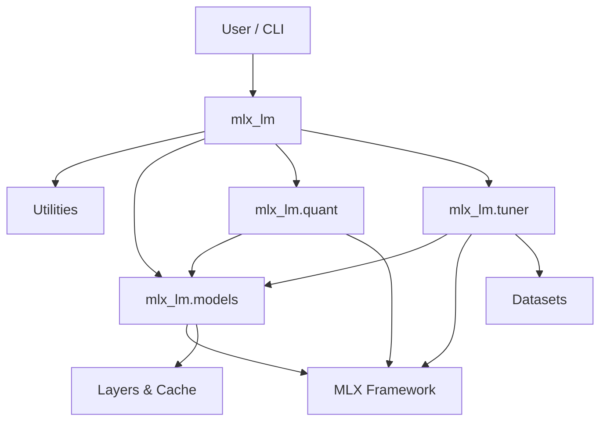

# Project Architecture: MLX-LM

## Executive Summary
**MLX-LM** is a high-performance framework for Large Language Models (LLMs) built on top of Apple's [MLX](https://github.com/ml-explore/mlx) array framework. It provides a comprehensive toolkit for running, converting, quantizing, and fine-tuning LLMs specifically optimized for Apple Silicon (M-series chips).

The project serves as both a library and a collection of command-line tools, enabling users to easily load Hugging Face models, perform efficient inference (including batching and speculative decoding), and fine-tune models using LoRA/QLoRA with minimal setup.

## Technology Stack
-   **Core Language**: Python 3.8+
-   **Compute Framework**: [MLX](https://github.com/ml-explore/mlx) (NumPy-like array framework with composable function transformations and lazy evaluation).
-   **Ecosystem Integration**:
    -   `transformers` (Hugging Face) for tokenization and model downloading.
    -   `numpy` for auxiliary data manipulation.
    -   `huggingface_hub` for interacting with the Model Hub.
-   **Server**: `http.server` (Python Standard Library) with `ThreadingHTTPServer`.
-   **Testing**: `unittest` with `xmlrunner`.

## Architecture Overview
The system follows a modular library architecture designed for composability. It does not enforce a strict monolithic application structure but rather exposes high-level APIs (`load`, `generate`) and low-level building blocks (`models`, `quant`, `tuner`).

### Design Philosophy
1.  **Lazy Evaluation**: Heavily relies on MLX's lazy evaluation graph to optimize compute graphs before execution.
2.  **Unified Model Interface**: All models implement a similar interface (`__call__`, `from_dict`, `sanitize`), enabling generic loading and inference logic.
3.  **Metal Optimization**: Custom kernels (in C++/Metal via MLX) for critical operations like fused kernels, quantization, and loss functions.

## Component Map

### 1. Core Package (`mlx_lm`)
The entry point for most users.
-   **`load(path_or_repo)`**: Unified loader for models and tokenizers. Handles downloading from HF Hub, weight loading, and architecture instantiation.
-   **`generate` / `stream_generate`**: Inference engines supporting simple generation, streaming, batching, and speculative decoding.
-   **`convert`**: Utilities to convert Hugging Face PyTorch weights to MLX format (`.safetensors`).

### 2. CLI Tools
Command-line interfaces exposed via `entry_points`.
-   **`mlx_lm.server`**: OpenAI-compatible API server using `http.server`. Supports `/v1/completions` and `/v1/chat/completions`.
-   **`mlx_lm.convert`**: Tool for converting, quantizing, and uploading models.
-   **`mlx_lm.manage`**: Cache management tool to scan and delete downloaded models.
-   **`mlx_lm.chat`**: Interactive terminal chat.

### 3. Model Zoo (`mlx_lm.models`)
Implementations of various LLM architectures.
-   **Base Classes**: `BaseModelArgs` for configuration.
-   **Architectures**: `llama`, `mixtral`, `qwen`, `gemma`, `phi`, `deepseek`, etc.
-   **Layers**:
    -   `Attention`: Standard and variants (MQA, GQA).
    -   `RoPE`: Rotary Positional Embeddings.
    -   `SwitchLayers`: MoE (Mixture of Experts) implementations like `SwitchGLU`.
    -   `KVCache`: Efficient Key-Value cache implementations (`RotatingKVCache`, `QuantizedKVCache`, `BatchKVCache`).

### 4. Inference Engine
Located within `generate.py` and `cache.py`.
-   **KV Caching**: Supports rotating caches (for infinite generation), quantized caches (for memory efficiency), and batch caches.
-   **Sampling**: Top-k, Top-p, Min-p, and XTC sampling strategies implemented in `sample_utils.py`.
-   **Optimization**: Speculative decoding support to accelerate generation using smaller draft models.

### 5. Quantization (`mlx_lm.quant`)
Tools for reducing model size and memory footprint.
-   **Methods**:
    -   **AWQ** (Activation-aware Weight Quantization).
    -   **GPTQ** (Generative Pre-trained Transformer Quantization).
    -   **Dynamic**: Sensitivity-based mixed-precision quantization.
-   **Implementation**: utilities to calibrate on datasets and apply quantization schemes.

### 6. Tuner (`mlx_lm.tuner`)
Fine-tuning infrastructure.
-   **LoRA / QLoRA**: Low-Rank Adaptation layers (`LoRALinear`, `LoRASwitchLinear`) that wrap base layers.
-   **Trainer**: Training loop with gradient accumulation, checkpointing, and callback support.
-   **Losses**: Custom Metal-optimized implementations of KL Divergence and JS Divergence.
-   **Datasets**: Abstractions for Text, Chat, and Completion datasets.

## Data Flow

### Inference Flow
1.  **Input**: User prompt (text).
2.  **Tokenization**: `TokenizerWrapper` encodes text to IDs (handling chat templates).
3.  **Model Load**: `load()` fetches weights/config, instantiates specific model class (e.g., `LlamaModel`).
4.  **Generation Loop**:
    -   **Prefill**: Process prompt tokens, populate `KVCache`.
    -   **Decode**: Auto-regressive generation step-by-step.
        -   Forward pass → Logits.
        -   Sampling (Top-p, Temp, etc.) → Next Token.
        -   Update `KVCache`.
5.  **Detokenization**: Convert IDs back to text (streaming or batch).

### Training Flow (LoRA)
1.  **Setup**: Load base model, freeze weights.
2.  **Adaptation**: Inject LoRA layers into target modules (Linear/Embedding).
3.  **Data Loading**: Stream batches from `CacheDataset`.
4.  **Training Loop**:
    -   Forward pass (Base + LoRA).
    -   Compute Loss (CrossEntropy/KL).
    -   Backward pass (Gradient computation via MLX).
    -   Optimizer Step (Update LoRA weights).
5.  **Save**: Export adapters (`adapters.safetensors`).

## Dependency Graph

## Key Design Patterns
-   **Factory Pattern**: `load()` inspects config to instantiate the correct model class.
-   **Decorator/Wrapper**: `LoRALinear` wraps standard linear layers to intercept forward passes.
-   **Strategy Pattern**: `Sampler` strategies (Top-k, Top-p) are composable.
-   **Mixins/Composition**: `ModelArgs` uses dataclasses for flexible configuration management.

## Build & Deployment
-   **Packaging**: Standard `setup.py` using `setuptools`.
-   **CI/CD**: GitHub Actions for linting and testing (specifically on self-hosted macOS runners to access Metal GPU).
-   **Distribution**: PyPI package `mlx-lm`.